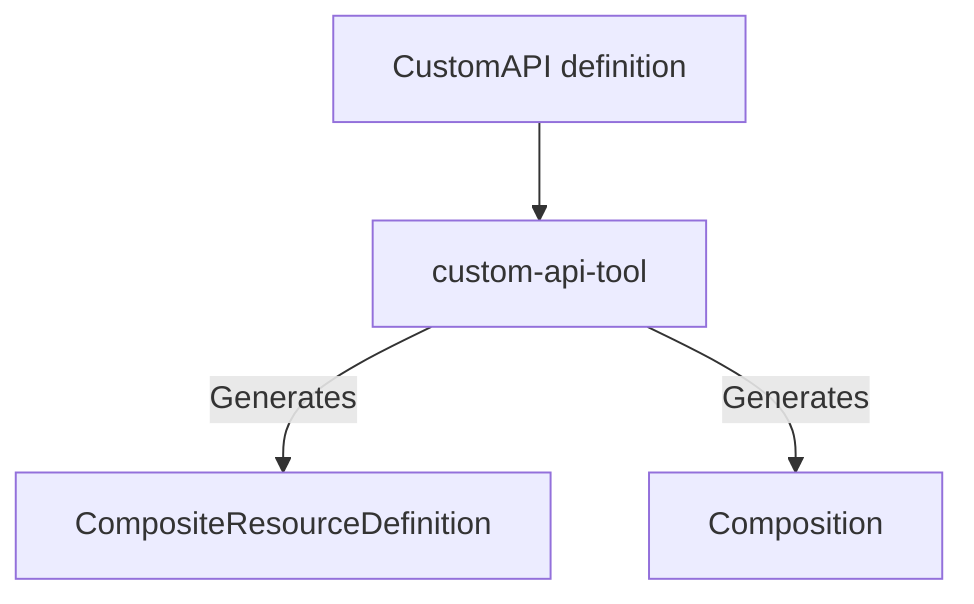

# custom-api-tool

A tool for maintaining Crossplane XRDs and Compositions in CUE.

## Architecture

A CustomAPI is a CUE definition including the desired schema for a new custom Kubernetes API together with functions that Crossplane should use to create and manage new composite resources.
With CUE's first class support for OpenAPI data schemas, complex CompositeResourceDefinitions can be generated from safe CUE schemas.
Pair this with the [function-cue](https://github.com/crossplane-contrib/function-cue) Crossplane Function and we can have Crossplane evaluate the same CUE as defined in the CustomAPI.
As Crossplane is evaluating the same CUE, we can easily validate and test the CustomAPI just with CUE (i.e. no need to apply it to a Kubernetes cluster).




## Usage

Example showing how to install the WebApp sample API to a Kubernetes cluster:

```console
$ dagger -m github.com/orvis98/custom-api-tool call gen --api ./samples/webapp.cue | kubectl apply -f - --server-side
$ kubectl apply -f ./samples/webapp.yaml

$ kubectl get object
NAME                        KIND             PROVIDERCONFIG   SYNCED   READY   AGE
demo-2cjfb-deployment       Deployment       default          True     True    2s
demo-2cjfb-httproute        HTTPRoute        default          True     True    2s
demo-2cjfb-secret           Secret           default          True     True    2s
demo-2cjfb-securitypolicy   SecurityPolicy   default          True     True    2s
demo-2cjfb-service          Service          default          True     True    2s
```

Example showing how a CustomAPI can be tested without Crossplane:

```console
$ dagger -m github.com/orvis98/custom-api-tool call test --api ./samples/webapp.cue --manifest ./samples/webapp.yaml
desired:
  composite:
    resource:
      status:
        hostnames:
          - demo
  resources:
    deployment:
      resource:
        apiVersion: apps/v1
        kind: Deployment
        metadata:
          name: demo
          namespace: default
        spec:
          replicas: 1
          selector:
            matchLabels:
              composite.crossplane.io/name: demo
          template:
            metadata:
              labels:
                composite.crossplane.io/name: demo
            spec:
              containers:
                - image: nginx
                  name: webapp
                  ports:
                    - containerPort: 80
    service:
      resource:
        apiVersion: v1
        kind: Service
        metadata:
          name: demo
          namespace: default
        spec:
          ports:
            - name: http
              port: 80
              targetPort: 80
          selector:
            composite.crossplane.io/name: demo
    httproute:
      resource:
        apiVersion: gateway.networking.k8s.io/v1
        kind: HTTPRoute
        metadata:
          name: demo
          namespace: default
        spec:
          hostnames:
            - demo
          parentRefs:
            - name: webapps
              namespace: default
              sectionName: http
          rules:
            - backendRefs:
                - group: ""
                  kind: Service
                  name: demo
                  port: 80
                  weight: 1
              matches:
                - path:
                    type: PathPrefix
                    value: /
    secret:
      resource:
        apiVersion: v1
        kind: Secret
        metadata:
          name: demo
          namespace: default
        stringData:
          .htpasswd: |
            foo:{SHA}Ys23Ag/5IOWqZCw9QGaVDdHwH00=
    securitypolicy:
      resource:
        apiVersion: gateway.envoyproxy.io/v1alpha1
        kind: SecurityPolicy
        metadata:
          name: demo
          namespace: default
        spec:
          basicAuth:
            users:
              group: ""
              kind: Secret
              name: demo
          targetRef:
            group: gateway.networking.k8s.io
            kind: HTTPRoute
            name: demo
```
